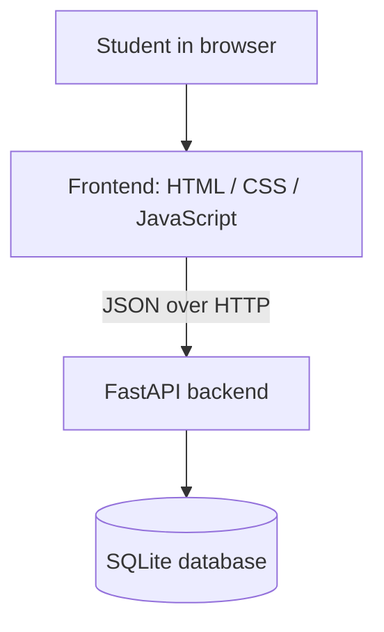

# CampusConnect

A simple web app where students report campus issues, view what others have reported, and track each issue from Open to Resolved.

## Overview

CampusConnect is our first full-stack project for the **Code2Chill — Weekly Project 01** challenge. Students register and log in, create issues (for example "Projector problem" or "Lost ID card"), browse all submitted issues on a dashboard, open an issue to see its details, and update its status.

The goal is to build a small but genuinely working website, and to learn how a frontend, a backend, and a database work together while collaborating through GitHub.

**Project idea:** one clean place for students to report and follow common problems around their college campus.

## Features

- Register, log in, and log out
- Create an issue with a title, description, and category
- Dashboard listing all submitted issues
- Issue Details page showing title, description, category, status, who submitted it, and when
- Update an issue's status: **Open**, **In Progress**, **Resolved**
- Simple Profile page for the logged-in student
- Clean, mobile-friendly interface in a university-app style
- Data saved in a SQLite database

**Issue categories:** Classroom · Campus · Lost & Found · General

## Screens / Pages

| Page | File |
|------|------|
| Login / Register | `frontend/index.html` |
| Dashboard | `frontend/dashboard.html` |
| Create Issue | `frontend/create-issue.html` |
| Issue Details | `frontend/issue.html` |
| Profile | `frontend/profile.html` |

## Tech Stack

| Layer | Technology |
|-------|------------|
| Frontend | HTML, CSS, JavaScript |
| Backend | Python, FastAPI |
| Database | SQLite |
| Version control | Git, GitHub |

## Project Architecture



FastAPI also serves the frontend files, so the whole app runs from one server.

## Project Structure

```
campusconnect/
├── backend/
│   ├── main.py              # app creation, startup, serves frontend
│   ├── database.py          # SQLite connection + table creation
│   ├── schemas.py           # request/response models, categories, statuses
│   ├── auth.py              # password hashing, tokens, current user
│   ├── routes_auth.py       # /auth endpoints
│   ├── routes_issues.py     # /categories and /issues endpoints
│   └── requirements.txt     # Python dependencies
├── frontend/
│   ├── index.html           # Login / Register
│   ├── dashboard.html       # Dashboard
│   ├── create-issue.html    # Create Issue
│   ├── issue.html           # Issue Details
│   ├── profile.html         # Profile
│   ├── css/
│   │   └── style.css
│   └── js/
│       ├── api.js
│       ├── ui.js
│       ├── auth.js
│       ├── dashboard.js
│       ├── create-issue.js
│       ├── issue.js
│       └── profile.js
├── spec.md                  # full product & technical specification
├── brief.md                 # short product brief
├── antigravity.md           # development rules for the AI coding agent
├── README.md
└── .gitignore
```

## How It Works

1. The student opens the website and registers or logs in.
2. The backend checks the credentials and returns a login token. The browser keeps it and sends it with every later request.
3. The Dashboard asks the backend for all issues and shows them as cards.
4. On the Create Issue page the student enters a title and description and picks a category. The backend validates the data, saves it in SQLite with status **Open**, and links it to the student.
5. Opening an issue shows its details. The student can change the status to **Open**, **In Progress**, or **Resolved**; the change is saved in the database.

## Getting Started

**Requirements:** Python 3.10 or newer, Git, and a web browser.

**1. Clone the repository**

```bash
git clone https://github.com/<your-username-or-org>/campusconnect.git
```

**2. Enter the project directory**

```bash
cd campusconnect
```

**3. Create a Python virtual environment**

```bash
python -m venv venv
```

**4. Activate the environment**

- Windows (Command Prompt / PowerShell): `venv\Scripts\activate`
- macOS / Linux: `source venv/bin/activate`

**5. Install dependencies**

```bash
pip install -r backend/requirements.txt
```

**6. Start the FastAPI server**

```bash
cd backend
uvicorn main:app --reload
```

**7. Open the frontend**

Go to **http://127.0.0.1:8000** in your browser. (Do not open the HTML files directly from your file explorer; they need the server.)

Interactive API documentation is available at **http://127.0.0.1:8000/docs**.

**8. Configuration**

No configuration is needed. The SQLite database file (`backend/campusconnect.db`) is created automatically the first time the server starts. To reset all data, stop the server and delete that file.

**Troubleshooting**
- `uvicorn: command not found` → the virtual environment is not active (step 4).
- "Address already in use" → another program uses port 8000; stop it, or run `uvicorn main:app --reload --port 8001` and open that port instead.

## API Overview

| Method | Endpoint | Purpose |
|--------|----------|---------|
| POST | `/auth/register` | Create a student account |
| POST | `/auth/login` | Log in and receive a token |
| POST | `/auth/logout` | Log out |
| GET | `/auth/me` | Logged-in student's information (Profile) |
| GET | `/categories` | List issue categories |
| GET | `/issues` | List all issues (Dashboard) |
| POST | `/issues` | Create an issue |
| GET | `/issues/{id}` | Get one issue (Issue Details) |
| PUT | `/issues/{id}/status` | Update an issue's status |

Full request/response details are in [`spec.md`](spec.md), section 12.

## Database

CampusConnect uses a single SQLite file with two tables:

- **`users`** — students (name, email, hashed password, login token, created date)
- **`issues`** — reported issues (title, description, category, status, reporter, created/updated dates)

One user can report many issues (`issues.reporter_id` → `users.id`). Passwords are never stored in plain text.

## GitHub Workflow

We work on the same codebase using branches and pull requests:

**Branch → Commit → Push → Pull Request → Review → Merge**

1. Create a branch for your task: `git checkout -b feature/short-task-name`
2. Make small commits with clear messages: `git commit -m "Add create issue form"`
3. Push your branch: `git push -u origin feature/short-task-name`
4. Open a Pull Request on GitHub and describe what you changed and how you tested it.
5. A teammate reviews it.
6. Merge into `main`, then everyone runs `git pull`.

Never commit directly to `main`. Every team member contributes through their own branches, commits, and pull requests.

## Team

- Member 1 — Role
- Member 2 — Role
- Member 3 — Role
- Member 4 — Role

## Future Improvements

These are ideas only and are **not** part of the current functionality:

- Filter and search issues on the Dashboard
- Summary counts of Open / In Progress / Resolved issues
- A "My issues" view

## Project Status

**In Development**
