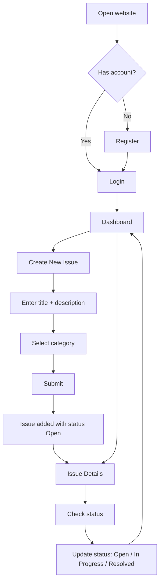
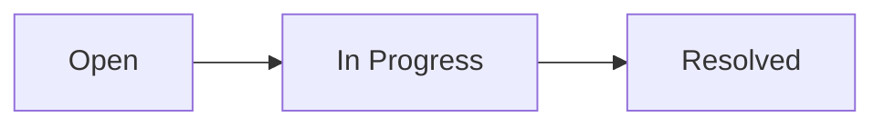
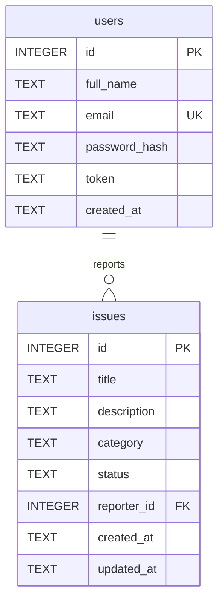

# CampusConnect — Product & Technical Specification

> **Source of truth:** the official project statement PDF (*Code2Chill — Weekly Project 01*).
> Anything in this document marked **[PDF]** comes directly from the PDF. Anything marked **[Decision]** is an implementation decision made by us to make the project work. Anything marked **[Optional]** is only built if the MVP is already stable.

---

## 1. Project Overview

**CampusConnect** is a simple web application where students can report and view common issues around their college campus (broken fans, Wi-Fi problems, lost items, and so on). **[PDF]**

- **Who it is for:** college students.
- **Problem it solves:** campus issues are usually reported informally and are easy to lose track of. CampusConnect gives students one place to submit an issue, see what others have reported, and check whether it has been handled.
- **Core objective:** build a small, polished, genuinely working full-stack website (frontend + backend + database) and learn to work as a team on GitHub. The PDF says: *"Don't focus on making it huge. Focus on making it work properly."* **[PDF]**

## 2. Project Goals

### Primary Goals
1. Deliver a working full-stack website that satisfies every requirement in the PDF.
2. Let a student register, log in, create issues, view issues, open issue details, and update issue status. **[PDF]**
3. Show how a frontend, backend, and database work together. **[PDF]**
4. Use a proper GitHub workflow where every member makes visible, meaningful contributions. **[PDF]**

### Secondary Goals
1. Keep the interface clean, simple, and mobile-friendly.
2. Keep the code simple enough for first-year students to read and maintain. **[Decision]**
3. Give the repository a clear README so a new visitor can run the project in minutes.

## 3. Scope

### In Scope
- Register and log in (and log out). **[PDF: register/login; logout is a Decision]**
- Create an issue with title, description, and category. **[PDF]**
- Dashboard listing all submitted issues. **[PDF]**
- Issue Details page. **[PDF]**
- View and update issue status (Open / In Progress / Resolved). **[PDF]**
- Simple Profile page. **[PDF]**
- SQLite persistence. **[PDF]**
- GitHub repository with README, branches, commits, and pull requests. **[PDF]**

### Out of Scope
These are scope boundaries chosen by us. **They are not claimed to come from the PDF.** The PDF only says the site "does not need advanced animations, complicated dashboards, or anything beyond the requirements."

- Admin or role system (everyone is a student)
- Editing or deleting issues
- Comments, likes, or voting on issues
- Image or file uploads
- Real-time updates or push/email notifications
- Password reset, email verification, social login
- AI chatbot or recommendations
- Analytics, charts, or reports
- Payments or any third-party integration
- Deployment to a public server

## 4. Target Users

The only user type is the **student** of the college. **[PDF]** A student:
- is comfortable with a phone or laptop browser,
- wants to report a problem in under a minute,
- wants to see whether a problem has already been reported and what its status is.

There are no separate admin, staff, or teacher roles in the PDF, so none are built. **[Decision]**

## 5. Core User Flow

This flow follows the PDF's "Basic Flow of the Website". **[PDF]**



**Notes**
- After a successful registration, the frontend automatically logs the student in and opens the Dashboard. **[Decision]**
- After submitting an issue, the student is taken to that issue's Issue Details page. **[Decision]**

## 6. Functional Requirements

Each requirement lists its source.

| ID | Requirement | Source |
|----|-------------|--------|
| FR-01 | The system shall allow a student to register with full name, email, and password. | PDF §2 (register) / fields are a Decision |
| FR-02 | The system shall reject registration if the email is already used. | Decision |
| FR-03 | The system shall allow a registered student to log in with email and password. | PDF §2 |
| FR-04 | The system shall allow a logged-in student to log out. | Decision |
| FR-05 | The system shall send a visitor who is not logged in to the Login / Register page when they open any other page. | Decision |
| FR-06 | The system shall allow a logged-in student to create an issue. | PDF §2 |
| FR-07 | The create-issue form shall require a short title and a description. | PDF §2 |
| FR-08 | The create-issue form shall require selecting a category from the supported category list. | PDF §2 |
| FR-09 | A newly created issue shall have the status **Open**. | PDF §4 flow (Open → In Progress → Resolved) |
| FR-10 | Each issue shall store who submitted it and when. | PDF §5 ("basic information about the submission") |
| FR-11 | The Dashboard shall show a list of all submitted issues. | PDF §2, §5 |
| FR-12 | Each Dashboard item shall show at least the title, category, and current status. | PDF §2 (view submitted issues, see status) |
| FR-13 | A student shall be able to open any issue from the Dashboard to see its details. | PDF §2 |
| FR-14 | The Issue Details page shall show the title, description, category, status, and basic submission information (reporter name and date submitted). | PDF §5 |
| FR-15 | A student shall be able to update an issue's status to **Open**, **In Progress**, or **Resolved**. | PDF §2 |
| FR-16 | A status update shall be saved and shall be visible on both the Issue Details page and the Dashboard. | PDF §2 (see current status) |
| FR-17 | The Profile page shall show the logged-in student's information. | PDF §5 |
| FR-18 | All users, issues, and statuses shall be stored in a SQLite database. | PDF §6 |
| FR-19 | The frontend shall communicate with the FastAPI backend through a REST API. | PDF §6 (frontend, backend, database work together) |
| FR-20 | The system shall validate input and show clear error messages for invalid input. | Decision |
| FR-21 | The interface shall be clean and simple, without advanced animations or complicated dashboards. | PDF §2 |
| FR-22 | The repository shall contain a README.md with: project name, project idea, features, technologies used, how to run the project, and team members. | PDF §7 |
| FR-23 | Every team member shall make visible, meaningful contributions through GitHub commits, branches, or pull requests. | PDF §7 |
| FR-24 | The team shall use the workflow Branch → Commit → Push → Pull Request → Merge. | PDF §7 |
| FR-25 | The project shall use only: HTML, CSS, JavaScript, Python, FastAPI, SQLite, Git, GitHub. | PDF §6 |

## 7. Pages / Screens

The PDF requires five pages. **[PDF §5]**

| # | Page | Frontend file |
|---|------|---------------|
| 1 | Login / Register | `frontend/index.html` |
| 2 | Dashboard | `frontend/dashboard.html` |
| 3 | Create Issue | `frontend/create-issue.html` |
| 4 | Issue Details | `frontend/issue.html` (opened as `issue.html?id=<issue id>`) |
| 5 | Profile | `frontend/profile.html` |

All pages except Login / Register share a top navigation bar: **Dashboard**, **New Issue**, **Profile**, **Logout**. **[Decision]**

### 7.1 Login / Register
- **Purpose:** let a student create an account or log in.
- **User actions:** switch between Login and Register forms; submit either form.
- **Information displayed:** app name and tagline; form fields; error/success messages.
- **UI components:** centered card, two tabs (Login / Register), inputs, primary button, message area.
- **API dependencies:** `POST /auth/register`, `POST /auth/login`.
- **Behavior:** if a valid token already exists, go straight to the Dashboard.

### 7.2 Dashboard
- **Purpose:** show the list of submitted campus issues.
- **User actions:** scroll the list; click an issue to open its details; click "New Issue".
- **Information displayed:** each issue's title, category, status badge, reporter name, and date.
- **UI components:** page header, "New Issue" button, issue cards, status badges, empty state.
- **API dependencies:** `GET /issues`.
- **Optional:** status/category filter and a search box; summary counts (Open / In Progress / Resolved). See section 22.

### 7.3 Create Issue
- **Purpose:** submit a new issue.
- **User actions:** type a title and description, choose a category, submit, or cancel.
- **Information displayed:** form with field hints and validation messages.
- **UI components:** card form, text input, textarea, category dropdown, submit and cancel buttons.
- **API dependencies:** `GET /categories` (fills the dropdown), `POST /issues`.

### 7.4 Issue Details
- **Purpose:** show one issue in full and let the student change its status.
- **User actions:** read the issue; choose a new status and save; go back to the Dashboard.
- **Information displayed:** title, description, category, current status, reporter name, date submitted, last updated.
- **UI components:** detail card, status badge, status dropdown + "Update status" button, back link.
- **API dependencies:** `GET /issues/{id}`, `PUT /issues/{id}/status`.

### 7.5 Profile
- **Purpose:** show the logged-in student's information.
- **User actions:** view information; log out.
- **Information displayed:** full name, email, member-since date, number of issues reported.
- **UI components:** profile card with initials avatar, info rows, logout button.
- **API dependencies:** `GET /auth/me`, `POST /auth/logout`.

## 8. Issue Model

| Field | Meaning | Source |
|-------|---------|--------|
| `id` | Unique issue number | Decision |
| `title` | Short title, 3–100 characters | PDF (title) / limits are a Decision |
| `description` | Description, 10–1000 characters | PDF (description) / limits are a Decision |
| `category` | One of the four categories in section 9 | PDF |
| `status` | `Open`, `In Progress`, or `Resolved` | PDF |
| `reporter_id` | The student who submitted the issue (links to `users`) | PDF ("basic information about the submission") |
| `created_at` | When the issue was submitted | Decision |
| `updated_at` | When the issue was last changed (status update) | Decision |

When returned by the API, an issue also includes `reporter_name` (looked up from `users`).

## 9. Issue Categories

The PDF groups its examples under four headings and says teams "can add similar simple categories." **[PDF §3]**

**Decision:** we use the four headings as the official category list for the dropdown. The example items are **examples only**, not separate categories, and may be shown as placeholder hints in the form.

| Category (stored value) | Examples from the PDF (examples only) |
|-------------------------|----------------------------------------|
| `Classroom` | Fan not working, Light not working, Projector problem |
| `Campus` | Wi-Fi not working, Cleanliness issue, Water cooler not working |
| `Lost & Found` | Lost ID card, Found a water bottle, Lost a notebook |
| `General` | Library-related issue, Lab equipment issue, Other campus problem |

The list lives in **one place** in the backend (`schemas.py`) and is served by `GET /categories`, so the frontend never hard-codes it. Adding a similar simple category later means editing that one list.

## 10. Issue Status System

Statuses (exact wording from the PDF): **Open**, **In Progress**, **Resolved**. **[PDF]**



- Every new issue starts as **Open**.
- The expected progress is Open → In Progress → Resolved. **[PDF flow]**
- **Decision:** the API accepts any of the three values at any time (so a mistake can be corrected, e.g. Resolved → In Progress). This keeps the code simple.
- **Decision:** any logged-in student can update the status of any issue, because the PDF defines no admin role. *(See open team decision TD-1 in Appendix B.)*

| Status | Badge color | Meaning |
|--------|-------------|---------|
| Open | Red | Reported, nobody is working on it yet |
| In Progress | Amber | Being handled |
| Resolved | Green | Fixed / returned / closed |

## 11. Database Specification

Database: **SQLite**, a single file `backend/campusconnect.db`, created automatically on first server start. **[PDF: SQLite]**
Access: Python's built-in `sqlite3` module with parameterized queries (no ORM, no extra dependency). **[Decision]**

### Table `users`

| Column | Type | Constraints |
|--------|------|-------------|
| `id` | INTEGER | PRIMARY KEY AUTOINCREMENT |
| `full_name` | TEXT | NOT NULL |
| `email` | TEXT | NOT NULL, UNIQUE (stored lowercase) |
| `password_hash` | TEXT | NOT NULL (format `salt$hash`, never the plain password) |
| `token` | TEXT | NULL (current login token, cleared on logout) |
| `created_at` | TEXT | NOT NULL (UTC ISO-8601 timestamp) |

### Table `issues`

| Column | Type | Constraints |
|--------|------|-------------|
| `id` | INTEGER | PRIMARY KEY AUTOINCREMENT |
| `title` | TEXT | NOT NULL |
| `description` | TEXT | NOT NULL |
| `category` | TEXT | NOT NULL, CHECK in (`Classroom`, `Campus`, `Lost & Found`, `General`) |
| `status` | TEXT | NOT NULL, DEFAULT `'Open'`, CHECK in (`Open`, `In Progress`, `Resolved`) |
| `reporter_id` | INTEGER | NOT NULL, FOREIGN KEY → `users(id)` |
| `created_at` | TEXT | NOT NULL |
| `updated_at` | TEXT | NOT NULL |

### Relationship
One `users` row → many `issues` rows (`issues.reporter_id` → `users.id`).



`PRAGMA foreign_keys = ON` must be enabled for every connection.

## 12. API Specification

- Style: REST over HTTP, JSON bodies. Interactive docs are provided automatically by FastAPI at `/docs`.
- Authentication: protected endpoints need the header `Authorization: Bearer <token>`. **[Decision]**
- Error shape: `{"detail": "<message>"}` (FastAPI default). Validation errors use status `422`.
- Frontend and API are served from the **same origin** (see section 14), so no CORS configuration is needed.

### Endpoint summary

| Method | Endpoint | Auth | Purpose |
|--------|----------|------|---------|
| POST | `/auth/register` | No | Create a student account |
| POST | `/auth/login` | No | Log in, receive a token |
| POST | `/auth/logout` | Yes | Invalidate the current token |
| GET | `/auth/me` | Yes | Get the logged-in student's information (Profile) |
| GET | `/categories` | No | List the supported categories |
| GET | `/issues` | Yes | List all issues (Dashboard) |
| POST | `/issues` | Yes | Create an issue |
| GET | `/issues/{id}` | Yes | Get one issue (Issue Details) |
| PUT | `/issues/{id}/status` | Yes | Update an issue's status |

### POST `/auth/register`
- **Request body:** `{"full_name": "Asha Rao", "email": "asha@college.edu", "password": "secret123"}`
- **Success `201`:** `{"id": 1, "full_name": "Asha Rao", "email": "asha@college.edu", "created_at": "2026-10-07T10:00:00Z"}`
- **Errors:** `409` email already registered · `422` invalid input · `500` server/database error

### POST `/auth/login`
- **Request body:** `{"email": "asha@college.edu", "password": "secret123"}`
- **Success `200`:** `{"token": "<random string>", "user": {"id": 1, "full_name": "Asha Rao", "email": "asha@college.edu"}}`
- **Errors:** `401` "Invalid email or password" (same message whether the email or the password is wrong) · `422` · `500`

### POST `/auth/logout`
- **Request body:** none
- **Success `204`:** no content
- **Errors:** `401` missing or invalid token

### GET `/auth/me`
- **Success `200`:** `{"id": 1, "full_name": "Asha Rao", "email": "asha@college.edu", "created_at": "...", "issues_reported": 3}`
- **Errors:** `401`

### GET `/categories`
- **Success `200`:** `["Classroom", "Campus", "Lost & Found", "General"]`

### GET `/issues`
- **Success `200`:** array of issue objects, newest first:
  ```json
  [{
    "id": 5, "title": "Projector not turning on",
    "description": "Room 204 projector shows no signal.",
    "category": "Classroom", "status": "Open",
    "reporter_id": 1, "reporter_name": "Asha Rao",
    "created_at": "2026-10-07T10:00:00Z", "updated_at": "2026-10-07T10:00:00Z"
  }]
  ```
- **Errors:** `401` · `500`
- **[Optional]** query parameters `status`, `category`, `q` (search in title). Not part of the MVP.

### POST `/issues`
- **Request body:** `{"title": "Projector not turning on", "description": "Room 204 projector shows no signal.", "category": "Classroom"}`
- **Success `201`:** the created issue object (status is always `Open`; `reporter_id` comes from the token, never from the request body).
- **Errors:** `401` · `422` (missing field, too short/long, unknown category) · `500`

### GET `/issues/{id}`
- **Success `200`:** one issue object.
- **Errors:** `401` · `404` "Issue not found" · `500`

### PUT `/issues/{id}/status`
- **Request body:** `{"status": "In Progress"}`
- **Success `200`:** the updated issue object (`updated_at` refreshed).
- **Errors:** `401` · `404` "Issue not found" · `422` (status not one of the three allowed values) · `500`

## 13. Frontend Architecture

**Stack:** plain HTML, CSS, and JavaScript. No framework, no build step, no npm. **[PDF]**

### HTML structure
- One HTML file per page (see section 7).
- Every page uses the same skeleton: `<header>` navigation → `<main>` content → message area.
- Use semantic tags (`header`, `nav`, `main`, `section`, `form`, `button`) and a `<label>` for every input.
- Every page includes `<meta name="viewport" content="width=device-width, initial-scale=1">`.

### CSS organization
One file, `frontend/css/style.css`, with clearly commented sections in this order:
1. Design tokens (CSS variables for colors, spacing, radius)
2. Base / reset / typography
3. Layout (container, grid)
4. Navigation bar
5. Buttons
6. Cards
7. Forms
8. Status badges
9. Messages (error / success / empty / loading)
10. Responsive rules (media queries)

### JavaScript responsibilities

| File | Responsibility |
|------|----------------|
| `js/api.js` | Shared `apiRequest()` function (wraps `fetch`, adds the token header, handles errors); save/read/clear the token in `localStorage`; redirect to login on `401` |
| `js/ui.js` | Shared helpers: build the nav bar, create a status badge, show/hide messages, format dates |
| `js/auth.js` | Login / Register page logic |
| `js/dashboard.js` | Load and render the issue list |
| `js/create-issue.js` | Fill the category dropdown, validate and submit the form |
| `js/issue.js` | Load one issue, handle status update |
| `js/profile.js` | Load and render profile, handle logout |

Every page loads `api.js` and `ui.js` first, then its own script.

### API communication
- All requests go through `apiRequest()` so token handling and error handling exist in one place.
- The API base URL is relative (same origin), e.g. `fetch("/issues")`.

### Form validation
- The frontend checks required fields and length limits before sending, for instant feedback.
- The backend always validates again and is the final authority.

### UI state handling
Each page that loads data handles four states: **loading**, **empty**, **error**, **success**. State is kept in simple variables and in the DOM; there is no state library.
User-provided text (titles, descriptions, names) must be inserted with `textContent`, **never** `innerHTML`, to prevent script injection.

## 14. Backend Architecture

**Stack:** Python + FastAPI, run with Uvicorn. **[PDF: Python, FastAPI]**
Python packages: `fastapi` and `uvicorn` only. Pydantic ships with FastAPI; `sqlite3`, `hashlib`, `secrets` are in the Python standard library. **[Decision]**

### File layout and responsibility

| File | Responsibility |
|------|----------------|
| `backend/main.py` | Create the FastAPI app, create tables on startup, include the routers, serve the `frontend/` folder as static files |
| `backend/database.py` | Open SQLite connections, create the `users` and `issues` tables |
| `backend/schemas.py` | Pydantic models for request/response bodies; the `CATEGORIES` and `STATUSES` lists |
| `backend/auth.py` | Hash and check passwords, create tokens, `get_current_user` dependency |
| `backend/routes_auth.py` | Endpoints under `/auth` |
| `backend/routes_issues.py` | `/categories` and `/issues` endpoints |
| `backend/requirements.txt` | Python dependencies |

### Serving the frontend
`main.py` mounts the `frontend/` folder at `/` **after** all API routers. A student starts one server and opens `http://127.0.0.1:8000`. **[Decision]**

### Validation
Pydantic models enforce types and length limits; category and status are checked against `CATEGORIES` and `STATUSES`.

### Business logic
Kept inside the route functions or small helper functions: create user, check credentials, create issue, update status. No service/repository layers.

### Error handling
- Use `HTTPException` with a clear status code and message.
- Wrap database calls so an unexpected failure returns `500` with a generic message and logs the real error on the server only.

## 15. Security Basics

The PDF does not specify an authentication mechanism, so everything below is an **implementation decision**.

| Topic | Measure |
|-------|---------|
| Passwords | Never stored in plain text. Hash with PBKDF2-HMAC-SHA256 (`hashlib`) with a random salt per user. Never return a password or hash in any API response. Minimum 6 characters. |
| Login session | On login, generate a random token with `secrets.token_urlsafe(32)`, store it in `users.token`, return it, and the frontend sends it as `Authorization: Bearer <token>`. Logout clears it. |
| Database queries | Always use `?` placeholders. Never build SQL by joining strings with user input. |
| Input | Validate type, length, and allowed values in the backend. Trim whitespace. |
| Output | Frontend renders user text with `textContent`, never `innerHTML`. |
| Error messages | Login errors never reveal whether the email exists. Server errors never show stack traces to the user. |
| Secrets | No secrets are hard-coded or needed in the frontend. `.env`, `*.db`, and `venv/` are in `.gitignore`. |
| Ownership | `reporter_id` always comes from the token, never from the request body. |

**Known limitations (accepted for a learning project):** tokens do not expire; one active login per account (logging in elsewhere replaces the token); no rate limiting; no HTTPS in local development.

## 16. UI/UX Specification

**Style:** modern university utility app — clean cards, clear categories, strong hierarchy. Inspired by general usability patterns of campus apps; **no copying** of any existing app's branding, layout, or assets. CampusConnect has its own identity.

### Colors (CSS variables)

| Token | Value | Use |
|-------|-------|-----|
| `--color-primary` | `#9E1B32` | Deep university red: header, primary buttons, links |
| `--color-primary-dark` | `#7D1527` | Button hover |
| `--color-bg` | `#F5F5F7` | Page background |
| `--color-card` | `#FFFFFF` | Cards |
| `--color-text` | `#2B2B2B` | Main text |
| `--color-muted` | `#6B6B6B` | Secondary text |
| `--color-border` | `#E3E3E6` | Card and input borders |
| `--color-open` / `-bg` | `#B42318` / `#FDECEC` | Open badge |
| `--color-progress` / `-bg` | `#8A5A00` / `#FFF4D6` | In Progress badge |
| `--color-resolved` / `-bg` | `#1B6E3A` / `#E3F6E8` | Resolved badge |

### Typography
System font stack (`system-ui, -apple-system, "Segoe UI", Roboto, Arial, sans-serif`). No external fonts, so the site works offline. Page title 24px/bold, card title 18px/semibold, body 16px, small/meta 14px.

### Components
- **Cards:** white, 12px radius, 1px border, light shadow, 16–24px padding.
- **Buttons:** primary = solid red with white text; secondary = white with red border. Minimum height 44px for touch. Visible focus outline.
- **Forms:** label above input, full-width inputs, 44px height, red border + message on error.
- **Status badges:** small rounded pill with a colored dot **and** the status text (color is never the only signal).
- **Navigation:** red top bar with app name on the left and links on the right (Dashboard, New Issue, Profile, Logout).
- **Category chip:** small gray pill on each issue card.

### Page states

| State | Behavior |
|-------|----------|
| Loading | Plain text "Loading…" in place of the content |
| Empty | Dashboard with no issues: "No issues yet. Be the first to report one." plus a "New Issue" button |
| Error | Red message box with a clear sentence and, where useful, a "Try again" button |
| Success | Green message box (e.g. "Status updated.") that stays visible until the next action |

Avoid heavy gradients, animations, glassmorphism, and decorative clutter. A simple 150ms hover color change on buttons is the maximum animation.

## 17. Responsive Design

| Device | Width | Behavior |
|--------|-------|----------|
| Mobile | under 600px | Single column; nav links wrap or sit in a simple row; cards full width; buttons full width in forms |
| Tablet | 600–1023px | Dashboard cards in a 2-column grid; forms centered, max width 600px |
| Desktop | 1024px and up | Content container max width 1100px, centered; Dashboard cards in a 3-column grid |

Design mobile-first: write the mobile CSS first, then add `@media (min-width: …)` rules.

## 18. Error Handling

| Situation | What the student sees |
|-----------|----------------------|
| Invalid login | "Invalid email or password." shown above the login form; fields stay filled except password |
| Email already registered | "This email is already registered. Please log in." |
| Invalid form | Field-level message under the field (e.g. "Title must be at least 3 characters."); form is not submitted |
| Backend unavailable | "Cannot reach the server. Please check that it is running and try again." |
| Database error | "Something went wrong. Please try again." (details only in the server log) |
| Issue not found | Issue Details shows "This issue could not be found." with a link back to the Dashboard |
| Session expired / not logged in (`401`) | Token is cleared and the student is sent to Login / Register |
| Failed API request (any other) | Generic message "Something went wrong. Please try again." and the page stays usable |

## 19. GitHub Development Workflow

Required workflow **[PDF]**: **Branch → Commit → Push → Pull Request → Merge**.
Team practice **[Decision]**: add a **Review** step before merging: **Branch → Commit → Push → Pull Request → Review → Merge**.

### Rules
1. `main` always contains working code. Nobody commits directly to `main`.
2. Create a branch for each task: `feature/<short-task-name>` (e.g. `feature/login-page`) or `fix/<short-name>`.
3. Make small commits with clear messages (e.g. `Add create issue form`, not `update`).
4. Push the branch and open a Pull Request that explains what changed and how it was tested.
5. At least one **other** member reviews the PR. The technical lead helps first-year members review.
6. Merge after approval. Then everyone runs `git pull` on `main`.
7. Every member must have their own meaningful branches, commits, and PRs. **[PDF]** The whole project must **not** be built on one computer and uploaded at the end. **[PDF]**

### Member Roles / Team Responsibilities

---

#### Member 1 — Backend / Database / Authentication

**Primary responsibility:**

- FastAPI backend
- SQLite database
- Database schema and models
- Authentication backend
- Registration API (`POST /auth/register`)
- Login API (`POST /auth/login`)
- Logout API (`POST /auth/logout`)
- Authentication / token handling
- Current-user API (`GET /auth/me`)
- Issue-related backend APIs (`GET /categories`, `GET /issues`, `POST /issues`, `GET /issues/{id}`, `PUT /issues/{id}/status`)
- Request validation on the backend (Pydantic models, allowed-value checks)
- Backend error handling (`HTTPException`, generic `500` responses)
- Database integration (`database.py`, parameterized queries, `PRAGMA foreign_keys = ON`)
- API documentation / consistency (interactive `/docs`)
- Backend testing (happy path, invalid input, missing token, database persistence)

Member 1 is responsible for maintaining the backend/API contract that the frontend members will consume.

Member 1 must coordinate with the other members whenever a frontend API integration depends on a backend change.

---

#### Member 2 — Login / Register Frontend + Shared UI Foundation

**Primary responsibility:**

- Login page (`frontend/index.html`)
- Register page (`frontend/index.html` — tabbed form)
- Login/register frontend JavaScript (`js/auth.js`)
- Authentication flow integration with the backend (`POST /auth/register`, `POST /auth/login`)
- Frontend authentication state handling where applicable (token storage in `localStorage`, redirect to Dashboard on success)
- Shared navigation / header patterns
- Shared frontend design patterns
- Shared CSS / design-system foundation (`frontend/css/style.css`)
- Common buttons, inputs, cards, typography, spacing, and reusable UI patterns
- Responsive foundation for common layouts

Member 2 must ensure that the authentication pages and shared UI patterns follow the CampusConnect visual design system defined in section 16.

---

#### Member 3 — Dashboard + Issue Details

**Primary responsibility:**

- Dashboard page (`frontend/dashboard.html`)
- Dashboard JavaScript (`js/dashboard.js`)
- Fetching and displaying submitted issues (`GET /issues`)
- Issue cards / list UI (title, category chip, status badge, reporter name, date)
- Issue Details page (`frontend/issue.html`)
- Issue Details JavaScript (`js/issue.js`)
- Displaying issue title, description, category, and status (`GET /issues/{id}`)
- Status display (status badge, colored pill)
- Status update UI (status dropdown + "Update status" button)
- Status update API integration (`PUT /issues/{id}/status`)
- Loading, empty, and error states for Dashboard and Issue Details
- Responsive UI for Dashboard and Issue Details

Member 3 is responsible for the user journey:

> Dashboard → Open Issue → View Details → Check Status → Update Status

---

#### Member 4 — Create Issue + Profile

**Primary responsibility:**

- Create Issue page (`frontend/create-issue.html`)
- Create Issue JavaScript (`js/create-issue.js`)
- Client-side form validation (required fields, length limits, category selection)
- Create Issue API integration (`GET /categories` for dropdown, `POST /issues` for submission)
- Profile page (`frontend/profile.html`)
- Profile JavaScript (`js/profile.js`)
- Current student information display (`GET /auth/me`: full name, email, member-since date)
- Student issue history / profile statistics where supported by the existing API (e.g. `issues_reported` from `GET /auth/me`)
- Loading, success, empty, and error states for Create Issue and Profile
- Responsive UI for Create Issue and Profile

Member 4 owns the complete frontend flow for:

> Create Issue → Validate Form → Submit Issue → API Integration → Handle Response

and:

> Profile → Fetch Current User → Display Student Information → Display Student's Submitted Issues / Statistics where supported by the existing API

> [!IMPORTANT]
> Member 4 must use the existing API architecture defined in section 12. Do not invent new API endpoints, database fields, authentication mechanisms, or technologies merely to support the Profile or Create Issue page. If a required frontend feature is not currently supported by the backend/API specification, the limitation must be documented rather than silently inventing a new backend requirement.

---

#### Shared Responsibilities

All four members are responsible for:

- Git / GitHub workflow
- Their own feature branch (`feature/<short-task-name>`)
- Meaningful commits with clear messages
- Pull Requests that describe what changed and how it was tested
- Code review (at least one other member reviews before merging)
- Testing their own work (happy path, invalid input, missing input, backend failure)
- Fixing bugs related to their own contribution
- Keeping code beginner-friendly (no clever one-liners, no unnecessary abstractions)
- Following `antigravity.md`
- Following `spec.md`
- Communicating API changes with the relevant team members

The team must follow:

> Branch → Commit → Push → Pull Request → Review → Merge

No member should independently rewrite another member's feature without coordination.

---

#### Role Boundaries

| Member | Area |
|--------|------|
| Member 1 | Backend / Database / Authentication |
| Member 2 | Login / Register / Shared UI Foundation |
| Member 3 | Dashboard / Issue Details / Status Updates |
| Member 4 | Create Issue / Validation / Profile / API Integration |

Avoid assigning the same major feature as the primary responsibility of multiple members. Collaboration is allowed when integration requires it.

### Suggested 4-day plan (a suggestion)
- **Day 1:** repository, skeleton, database, auth backend, Login / Register page.
- **Day 2:** issues backend (create, list, get), Create Issue page, Dashboard.
- **Day 3:** Issue Details, status update, Profile, styling and responsive layout.
- **Day 4:** testing, bug fixes, README completion, final PR merges.

## 20. Definition of Done

The project is complete when **all** boxes are true:

- [ ] A student can register, log in, and log out.
- [ ] A logged-in student can create an issue with title, description, and category.
- [ ] The Dashboard lists submitted issues.
- [ ] Clicking an issue opens Issue Details with title, description, category, status, and submission info.
- [ ] Status can be updated to Open, In Progress, and Resolved, and the change persists after a page refresh.
- [ ] The Profile page shows the logged-in student's information.
- [ ] Frontend is connected to the backend (all pages use the real API, no fake data).
- [ ] Backend is connected to SQLite (data survives a server restart).
- [ ] Pages that require login redirect to Login / Register when not logged in.
- [ ] Invalid input shows clear error messages.
- [ ] Layout works on a phone-sized screen and a desktop screen.
- [ ] Only the approved technologies are used.
- [ ] README.md is complete and its run instructions work on a fresh clone.
- [ ] Every team member has visible commits, branches, and/or PRs on GitHub.
- [ ] Work was merged through Pull Requests.
- [ ] Basic testing (section 21) has been done and the results noted in the final PR.

## 21. Acceptance Criteria

| ID | Feature | Acceptance criteria |
|----|---------|---------------------|
| AC-01 | Register | **Given** a new email, **when** the student submits a valid form, **then** the account is created and the student lands on the Dashboard. |
| AC-02 | Register (duplicate) | **Given** an email already registered, **when** the form is submitted, **then** an "already registered" message appears and no second account is created. |
| AC-03 | Register (invalid) | **Given** an empty name, bad email, or password under 6 characters, **then** an error is shown and no request creates an account. |
| AC-04 | Login | **Given** correct credentials, **then** the student lands on the Dashboard. **Given** wrong credentials, **then** "Invalid email or password." is shown. |
| AC-05 | Logout | **When** the student clicks Logout, **then** they return to Login / Register and cannot open the Dashboard without logging in again. |
| AC-06 | Route protection | **Given** no login, **when** `dashboard.html` is opened, **then** the student is sent to Login / Register. |
| AC-07 | Create issue | **Given** title, description, and category, **when** submitted, **then** the issue is saved with status Open, linked to the logged-in student, and its Issue Details page opens. |
| AC-08 | Create issue (invalid) | **Given** a missing title/description/category or a too-short value, **then** field-level errors appear and nothing is saved. |
| AC-09 | Category list | The dropdown shows exactly `Classroom`, `Campus`, `Lost & Found`, `General`. |
| AC-10 | Dashboard | **Given** N saved issues, **then** N cards appear, newest first, each with title, category, status badge, reporter, and date. With zero issues, the empty state appears. |
| AC-11 | Issue Details | **When** a card is clicked, **then** the page shows title, description, category, status, reporter name, and submitted date. |
| AC-12 | Issue not found | **Given** `issue.html?id=99999`, **then** "This issue could not be found." appears. |
| AC-13 | Update status | **When** the student selects a new status and saves, **then** the badge updates, a success message shows, and after a refresh the new status is still shown on both Issue Details and the Dashboard. |
| AC-14 | Invalid status | **When** the API receives a status other than the three allowed values, **then** it responds `422` and the stored status is unchanged. |
| AC-15 | Profile | The page shows the logged-in student's full name, email, and member-since date. No password data is shown. |
| AC-16 | Persistence | After stopping and restarting the server, all users and issues are still present. |
| AC-17 | Backend down | **Given** the server is stopped, **when** a page tries to load data, **then** the "Cannot reach the server" message appears instead of a blank page. |
| AC-18 | Responsive | At 360px width there is no horizontal scrolling and all buttons are tappable; at 1280px content is centered and readable. |
| AC-19 | GitHub | Repository has README.md with all six required items; each of the 4 members has at least one merged PR with their own commits. |

**Basic testing checklist (manual):** for each feature test the happy path, invalid input, missing input, server stopped, and a refresh after saving. API endpoints can be tried at `/docs`.

## 22. MVP vs Optional Enhancements

### MVP (mandatory)
Everything in sections 6, 7, 20, and 21: register, login, logout, route protection, create issue, Dashboard list, Issue Details, status update, Profile, SQLite storage, simple responsive UI, README, GitHub workflow with contributions from every member.

### Optional (only after the MVP is stable and merged)
- Dashboard summary counts (Open / In Progress / Resolved), computed in the frontend from the existing issue list
- Filter the Dashboard by status or category (`GET /issues?status=…&category=…`)
- Search issues by title (`q` parameter)
- "My issues" toggle on the Dashboard
- Show example text as placeholder hints in the Create Issue form per selected category
- Small polish items: favicon, nicer empty-state illustration using CSS only

Optional work must never delay or break an MVP feature.

---

## Appendix A — PDF Requirements Traceability

| PDF reference | Requirement | Covered by |
|---------------|-------------|-----------|
| §1 | Simple web app for students to report and view campus issues; beginner-friendly; focus on basics | Sections 1–3 |
| §2 | Register and log in | FR-01, FR-03 |
| §2 | Create a campus issue/report | FR-06 |
| §2 | Select a category | FR-08 |
| §2 | Short title and description | FR-07 |
| §2 | View submitted issues | FR-11, FR-12 |
| §2 | Open an issue to see details | FR-13, FR-14 |
| §2 | See current status | FR-12, FR-14, FR-16 |
| §2 | Update status among Open / In Progress / Resolved | FR-15 |
| §2 | Simple dashboard of submitted issues | FR-11 |
| §2 | Clean, simple interface; no advanced animations or complicated dashboards | FR-21, section 16 |
| §3 | Example issues and four groups; teams may add similar simple categories | Section 9 (examples, not requirements) |
| §4 | Basic flow of the website | Section 5 |
| §5 | Pages: Login / Register, Dashboard, Create Issue, Issue Details, Simple Profile | Section 7, FR-17 |
| §5 | Issue Details shows title, description, category, status, basic submission info | FR-14 |
| §6 | HTML, CSS, JavaScript, Python, FastAPI, SQLite, Git, GitHub only | FR-25, sections 13–14 |
| §7 | README with project name, idea, features, technologies, how to run, team members | FR-22 |
| §7 | Every member contributes visibly through commits/branches/PRs | FR-23, section 19 |
| §7 | Not built on one person's system and uploaded at the end | Section 19 rule 7 |
| §7 | Branch → Commit → Push → Pull Request → Merge | FR-24, section 19 |
| §7 | Small but working; make it work properly | Sections 1, 2, 22 |

## Appendix B — Implementation Decisions and Open Team Decisions

### Implementation decisions (made in this document)
1. Registration fields: full name, email, password. The PDF only says "register" and shows "the logged-in student's information" on Profile.
2. The four PDF headings are the official categories; example items are only examples.
3. Token-based login with the token stored in `users.token`; PBKDF2 password hashing from the standard library.
4. FastAPI serves the frontend, so there is a single server and no CORS setup.
5. Raw `sqlite3` instead of an ORM, to keep dependencies to `fastapi` and `uvicorn`.
6. Any of the three statuses can be set at any time.
7. Validation limits: name 2–60, email valid and up to 120 characters, password 6–100, title 3–100, description 10–1000.
8. Logout, route protection, `GET /categories`, and the Review step in the GitHub workflow are additions, not PDF requirements.

### Open team decisions
- **TD-1 — Who may update status?** Current decision: any logged-in student. Alternative: only the student who reported the issue. The PDF does not say; confirm with the club or mentor.
- **TD-2 — Status transitions:** any change allowed (current) vs forward-only (Open → In Progress → Resolved). The PDF shows the forward flow but does not forbid corrections.
- **TD-3 — Member roles:** the task split in section 19 is only a suggestion; the team should confirm who does what.
